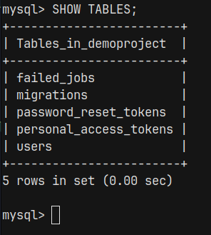
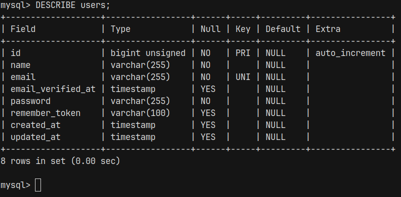
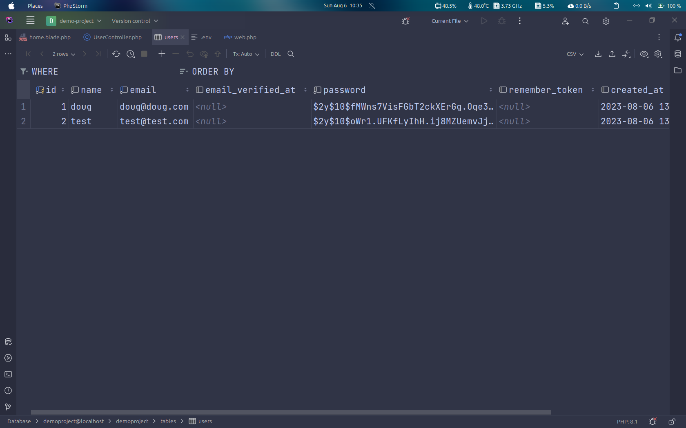

# Introdução ao Laravel

Antes de começarmos o tutorial, vamos falar sobre uma ferramenta chamada Composer

## Composer
Composer é um gerenciador de dependências para PHP. Podemos pensar no Composer como sendo semelhante ao NPM do Node. Ou seja, podemos instalar pacotes(bibliotecas) e outras coisas utilizando o Composer.

## Instalando o Composer no Linux

Para instalar o composer basta acessar a [documentação oficial](https://getcomposer.org/doc/00-intro.md#installation-linux-unix-macos) ou instalar utilizando o [homebrew](https://formulae.brew.sh/formula/composer#default). Caso tenha dificuldades, basta seguir o tutorial da [DigitalOcean](https://www.digitalocean.com/community/tutorials/how-to-install-and-use-composer-on-ubuntu-20-04).

## Usando Composer

O comando **composer require package_name** realiza o download o pacote.

```php
composer require cocur/slugify
```

No exemplo acima, todos os arquivos que preciamos estar no diretório vendor.

Abaixo fazemos a "importação" do arquivo autoload.php no nosso arquivo index.php. Já a linha **use Cocur\Slugify\Slugify;** funciona como o import ou require do NodeJS. 
```php
<?php

require __DIR__ . '/vendor/autoload.php';
use Cocur\Slugify\Slugify;

?>
```

Abaixo criamos uma instância da classe Slufigy e utilizamos o método slugify("The sky is blue, and the grass is green!");

```php
<?php

require __DIR__ . '/vendor/autoload.php';
use Cocur\Slugify\Slugify;

$slugify = new Slugify();
// O resultado é dado por:
// the-sky-is-blue-and-the-grass-is-green
echo $slugify->slugify("The sky is blue, and the grass is green!");

?>
```

## Instalando o framework Laravel utilizando Composer

O código abaixo faz uso do Composer, em seguida utilizamos as palavras reservadas **create-project** seguido do pacote que queremos instalar, nesse caso **laravel/laravel** e por fim adicionamos um ponto no final, isso indica que o pacote será instalado no diretório atual.

```php
composer create-project laravel/laravel .
```

Para rodar um servidor local basta utilizar o Artisan

```php
php artisan serve
```

O comando acima vai abrir um servidor local com o url e a porta por padrão.

```txt
INFO  Server running on [http://127.0.0.1:8000].  
```

## Introdução aos diretório do projeto e a blade template engine

No diretório **resources/views/welcome.blade.php** é armazenado a página inicial quando rodamos o artisan serve, nesse caso o laravel faz uso do template engine Blade. 

Já o diretório **routes/web.php** é onde fica os nossos routes, ou seja, o lugar onde armazena o roteamento das páginas quando tentamos acessar determinado URL.

Foi substituido o arquivo welcome.blade.php por um arquivo chamado **home.blade.php** no diretório **resources/views**

Dentro do arquivo **home.blade.php** foi adicionado o seguinte código

```php
<!doctype html>
<html lang="en">
<head>
    <meta charset="UTF-8">
    <meta name="viewport"
          content="width=device-width, user-scalable=no, initial-scale=1.0, maximum-scale=1.0, minimum-scale=1.0">
    <meta http-equiv="X-UA-Compatible" content="ie=edge">
    <title>Home</title>
</head>
<body>
    <div style="border: 3px solid black;">
        <h2>Register</h2>
        // /register basicamente é o URL no qual o usuário será redirecionado
        <form action="/register" method="POST">
            <label>Username:</label>
            <input type="text" name="name">
            <label>Email:</label>
            <input type="text" name="email">
            <label>Password:</label>
            <input type="password" name="password">
            <button>Register</button>
        </form>
    </div>
</body>
</html>

```

Acessando o diretório **routes/web.php** e criando um **router** temos

```php
<?php

use Illuminate\Support\Facades\Route;

/*
|--------------------------------------------------------------------------
| Web Routes
|--------------------------------------------------------------------------
|
| Here is where you can register web routes for your application. These
| routes are loaded by the RouteServiceProvider and all of them will
| be assigned to the "web" middleware group. Make something great!
|
*/

Route::get('/', function () {
    return view('home');
});

// Primeiro parâmetro = o URL e segundo é uma função que é executada
// sempre que o URL é acessado.
Route::post('/register', function () {
    return 'Thank you!';
});

```

No entanto, quando clicarmos em Register será gerado um erro **419 - PAGE EXPIRED**, isso se deve a um problema envolvendo **CSRF**, para saber mais [clique aqui](https://www.ibm.com/docs/pt-br/sva/10.0.0?topic=configuration-prevention-cross-site-request-forgery-csrf-attacks)

Para se livrar do problema envolvendo **CSRF** basta ir no nosso arquivo **home.blade.php** e adicionar **@csrf** dentro do **form** e o problema será resolvido.

```php
<!doctype html>
<html lang="en">
<head>
    <meta charset="UTF-8">
    <meta name="viewport"
          content="width=device-width, user-scalable=no, initial-scale=1.0, maximum-scale=1.0, minimum-scale=1.0">
    <meta http-equiv="X-UA-Compatible" content="ie=edge">
    <title>Home</title>
</head>
<body>
    <div style="border: 3px solid black;">
        <h2>Register</h2>
        <form action="/register" method="POST">
            <!-- Resolve CSRF problem. -->
            @csrf
            <label>Username:</label>
            <input type="text" name="name">
            <label>Email:</label>
            <input type="text" name="email">
            <label>Password:</label>
            <input type="password" name="password">
            <button>Register</button>
        </form>
    </div>
</body>
</html>
```

## Trabalhando com Controllers

No arquivo **web.php** que lida com os **Routes** foi criando um novo roteamento e passado uma função anônima para o route, mas o comum é criamos uma lógica que irá lidar com esse redirecionamento quando a URL for acessada, nesse caso iremos fazer uso de controllers! Ou seja, podemos ter um **UserController, PostController, etc...**. Dessa forma, "dividimos a funcionalidade por assim dizer".

Os Controllers estão no diretório **app/Http/Controllers/Controller.php**.

Para criar um controller, podemos utilizar o artisan, vejamos:

```php
php artisan make:controller UserController
```

No exemplo acima passamos o argumento **make:controller** que basicamente cria automaticamente um controller para nós, por fim informamos o nome desse controller, nesse caso será **UserController.php**

O arquivo criado conterá o seguinte código:

```php
<?php

namespace App\Http\Controllers;

use Illuminate\Http\Request;

class UserController extends Controller
{
    // Nosso código vai aqui
}
```

Anteriormente utilizamos uma função anônima no nosso route para que seja exibido uma mensagem quando o usuário acessar a url /register, nesse caso iremos substituir essa função anônima pelo método criado abaixo, vejamos:

```php
<?php

namespace App\Http\Controllers;

use Illuminate\Http\Request;

class UserController extends Controller
{
    // Retorna a string abaixo
    public function register() {
        return "Hello from our controller!";
    }
}
```

Note que criamos um método chamado register(), utilizando ele no nosso arquivo **web.php** temos:

```php
<?php

// Importa a classe UserController e as suas funcionalidades
use App\Http\Controllers\UserController;
use Illuminate\Support\Facades\Route;

/*
|--------------------------------------------------------------------------
| Web Routes
|--------------------------------------------------------------------------
|
| Here is where you can register web routes for your application. These
| routes are loaded by the RouteServiceProvider and all of them will
| be assigned to the "web" middleware group. Make something great!
|
*/

Route::get('/', function () {
    return view('home');
});

// Primeiro parâmetro = o URL e segundo é uma função que é executada
// sempre que o URL é acessado.
Route::post('/register', [UserController::class, 'register']);

```

Note que passamos um array contendo dois valores no nosso Route, nesse caso o primeiro valor é a **nossa classe UserController** e o segundo valor é o **nosso método register()**. Por fim devemos **importar a classe UserController.**

Mas e se quisermos ter acesso aos dados digitados no campo? Bem, para isso podemos utilizar a **classe Request como parâmetro no método register()**, vejamos:

```php
<?php

namespace App\Http\Controllers;

use Illuminate\Http\Request;

class UserController extends Controller
{
    // Retorna a string abaixo
    public function register(Request $request) {
        // Utilizamos a função valide() passando como argumento um array contendo os atributos do form.
        // Caso o campo abaixo não seja validado, o usuário não será redirecionado para o /register.
        $incomingFields = $request->validate([
            // name possui tamanho mínimo de 3 caracteres e máximo de 10
            'name' => ['required', 'min:3', 'max:10'],
            'email' => ['required', 'email'],
            // name possui tamanho mínimo de 8 caracteres e máximo de 24
            'password' => ['required', 'min:8', 'max:24']
        ]);
        return "Hello from our controller!";
    }
}
```

No exemplo acima utilizamos a função valide() juntamente com um array associativo, a função validate irá validar os dados digitados pelo usuário. Note que utilizamos atributos como min:3, required etc. O usuário só será redirecionado para a url /register caso os dados sejam passados pela função valide(). Caso contŕario o usuário será "jogado" novamente para a parte de registro.

## Trabalhando com Banco de Dados MySQL

A partir de agora iremos conectar o nosso banco de dados MySQL com a nossa aplicação, dessa forma poderemos armazenar o registro do usuário no nosso banco de dados. Antes disso, é necessário criar um banco de dados, o banco que foi criado se chama **demoproject**. Para conectar o banco de dados com a aplicação basta abrir o arquivo **.env** e passar o nome do banco de dados criado, o user e a senha.

Beleza, criamos o banco de dados, mas e a(s) tabela(s), como ficam? Simples, o laravel dispõe a criação de tabelas padronizadas para o nosso uso, para isso basta utilizar o comando abaixo:

```php
php artisan migrate
```

O comando acima irá criar tableas padronizadas para o nosso uso em nosso banco de dados chamado demoproject.

As tabelas criadas são as descritas abaixo:



A tabela que iremos trabalhar no momento será a tabela users. A tabela user possui as seguintes características:




## Utilizando um Model

Um model é basicamente uma forma de **abstração** que nos permite executar certas lógicas envolvendo a nossa aplicação. Dessa forma, o nosso Model fica responsável por encapsular a complexidade e detalhes internos da nossa aplicação. Podemos ter Model's para User, Post, BlogPost, BlogPostComments etc...

Em resumo, um Model é uma forma de mapearmos a relação entre estruturas de dados e relações envolvendo um ou mais dados.

O model que iremos utilizar se chama **User.php**, ele atualmente já está criado por padrão.

```php
<?php

namespace App\Http\Controllers;

// Importa o model User
use App\Models\User;
use Illuminate\Http\Request;

class UserController extends Controller
{
    // Retorna a string abaixo
    public function register(Request $request) {
        // Utilizamos a função valide() passando como argumento um array contendo os atributos do form.
        // Caso o campo abaixo não seja validado, o usuário não será redirecionado para o /register.
        $incomingFields = $request->validate([
            // name possui tamanho mínimo de 3 caracteres e máximo de 10
            'name' => ['required', 'min:3', 'max:10'],
            'email' => ['required', 'email'],
            // name possui tamanho mínimo de 8 caracteres e máximo de 24
            'password' => ['required', 'min:8', 'max:24']
        ]);

        // Utilizamos uma hash com o algoritmo bcrypt antes de enviarmos para o DB.
        $incomingFields['password'] = bcrypt($incomingFields['password']);
        User::create($incomingFields);

        return "Hello from our controller!";
    }
}
```

No exemplo acima, note que utilizamos um algoritmo de hash chamado bcrypt para não deixar a senha do usuário sujeita a possível acesso caso a nossa aplicação venha a ser violada, após isso, utilizamos o nosso model **User** seguido de um método chamado **create($incomingFields)** que recebe os dados do formulário.

Por fim, ao preenchermos os campos de registro e enviarmos para o servidor temos que os dados serão armazenados no banco de dados e o usuário será registrado com sucesso.

O resultado é o exibido abaixo:



## Trabalhando com o conceito de Log in e Log out

O conceito de Log in e Log out envolve conceitos como session e cookies que já foram vistos anteriormente no estudo do [PHP Básico](PHP_BASICO.md). Mas para maiores detalhes, [esse tutorial](https://www.youtube.com/watch?v=uXDnS5PcjCA) apresenta um conteúdo bem completo e aprofundado sobre esses conceitos.


[Voltar](README.md)