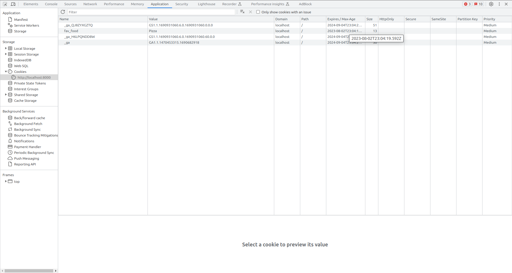

## Para iniciar um servidor PHP basta utilizar o comando

```php
php -S localhost:8000
```

## Variáveis em PHP

Para declarar variáveis em PHP devemos utilizar o caractere $ antes do nome da variável.

```php
<?php
    // String
    $nome = "Douglas";
    echo "Hello, {$nome}!";
    // Integer
    $idade = 23;
    echo "You are {$idade} years old!";
    // Float
    $peso = 65.5;
    echo "Your weight is {$peso}kg!";
?>
```

## Variáveis especiais $_GET e $_POST

São variáveis especiais responsáveis por coletar dados de formulários HTML.

- $_GET
    - Os dados são exibidos na URL.
    - Não é seguro.
    - Tem limite de caracteres.
    - Melhor utilizado para páginas de pesquisa.
- $_POST
    - Os dados são agrupados dentro do corpo da requisição HTTP.
    - É mais seguro.
    - Não possui limite de dados.
    - Melhor utilizado para dados sensíveis.

Os métodos $_GET e $_POST são variáveis especiais pois podem armazenar mais de um valor. Além disso, eles "podem ser consideardos um array"

```php
<!DOCTYPE html>
<html lang="en">
<head>
    <meta charset="UTF-8">
    <meta name="viewport" content="width=device-width, initial-scale=1.0">
    <title>Document</title>
</head>
<body>
    <form action="index.php" method="get">
        <label for="">Username:</label>
        <input type="text" name="username">
        <label for="">Password:</label>
        <input type="password" name="password">
        <input type="submit" value="Log in">
    </form>
</body>
</html>

<?php
    // Note que utilizamos [] para acessar o atrbiuto username e password
    echo "{$_GET["username"]} <br>";
    echo "{$_GET["password"]}";
?>
```

O exemplo acima gera um problema ao ser utilizado com $_GET, pois o valor será atribuido na URL: **http://localhost/dev/index.php?username=Teste&password=teste123** ou seja, não há segurança.

Utilizando $_POST temos segurança, pois os dados são agrupados dentro do corpo da requisição HTTP.

```php
<!DOCTYPE html>
<html lang="en">
<head>
    <meta charset="UTF-8">
    <meta name="viewport" content="width=device-width, initial-scale=1.0">
    <title>Document</title>
</head>
<body>
    <form action="index.php" method="post">
        <label for="">Username:</label>
        <input type="text" name="username">
        <label for="">Password:</label>
        <input type="password" name="password">
        <input type="submit" value="Log in">
    </form>
</body>
</html>

<?php
    // Note que utilizamos [] para acessar o atrbiuto username e password
    echo "{$_POST["username"]} <br>";
    echo "{$_POST["password"]}";
?>
```

Dessa forma quando o username e password forem enviados, temos que não serão exibidos na URL.

### Exemplo de programa que cálcula o IMC de uma pessoa e exibe o resultado

```php
<!DOCTYPE html>
<html lang="en">
<head>
    <meta charset="UTF-8">
    <meta name="viewport" content="width=device-width, initial-scale=1.0">
    <title>Document</title>
</head>
<body>
    <form action="index.php" method="post">
        <label for="">Nome:</label>
        <input type="text" name="nome"><br>
        <label for="">Idade:</label>
        <input type="number" name="idade"><br>
        <label for="">Peso:</label>
        <input type="decimal" name="peso"><br>
        <label for="">Altura:</label>
        <input type="decimal" name="altura"><br>
        <input type="submit" value="Enviar">
    </form>
</body>
</html>

<?php
    echo "{$_POST["nome"]}<br>";
    echo "{$_POST["idade"]}<br>";
    echo "{$_POST["peso"]}<br>";
    echo "{$_POST["altura"]}<br>";
    $peso = $_POST["peso"];
    $altura = $_POST["altura"];
    
    // Lidando com o problema da divisão por 0
    if ($altura <= 0) {
        echo "Altura inválida.";
    }
    else {
        // Realiza o cálculo do IMC.
        $imc_pessoa = round($peso / ($altura * $altura), 2);
        // Analisa o perfil do usuário.
        if ($imc_pessoa >= 0 && $imc_pessoa <= 18.5) {
            echo "O seu IMC é: {$imc_pessoa} e você está abaixo do peso.";
        }
        elseif ($imc_pessoa > 18.5 && $imc_pessoa <= 24.9) {
            echo "O seu IMC é: {$imc_pessoa} e você está com o peso ideal.";
        }
        elseif ($imc_pessoa > 24.9 && $imc_pessoa <= 29.9) {
            echo "O seu IMC é: {$imc_pessoa} e você está acima do peso.";
        }
        elseif ($imc_pessoa > 29.9 && $imc_pessoa <= 34.9) {
            echo "O seu IMC é: {$imc_pessoa} e você está com obesidade grau 1.";
        }
        elseif ($imc_pessoa > 34.9 && $imc_pessoa <= 39.9) {
            echo "O seu IMC é: {$imc_pessoa} e você está com obesidade grau 2(severa).";
        }
        elseif ($imc_pessoa >= 40) {
            echo "O seu IMC é: {$imc_pessoa} e você está com obesidade grau 3(mórbida).";
        }
        else {
            echo "IMC inválido.";
        }
    }
?>
```

## Loops em PHP

No exemplo abaixo foram utilizados for e while loop.

````php
<!DOCTYPE html>
<html lang="en">
<head>
    <meta charset="UTF-8">
    <meta name="viewport" content="width=device-width, initial-scale=1.0">
    <title>Document</title>
</head>
<body>
    <form action="index.php" method="post">
        <label for="">Digite um número:</label>
        <input type="number" name="numero"><br>
        <input type="submit" value="Enviar">
    </form>
</body>
</html>

<?php
    // Armazena o valor do campo numero
    $contador = $_POST["numero"];
    $rodando = false;
    // Exibe o resultado
    for ($i = 1; $i <= $contador; $i++) {
        echo $i . "<br>";

        if ($i == $contador) {
            $rodando = true;
        }
    }

    // Exemplo com while loop
    $num = 10;

    echo "<br>";

    if ($rodando) {
        while ($num > 0) {
            echo $num . "<br>";
            $num--;
        }
    }
?>
````

## Arrays em PHP

````php
<?php
    // Array de strings
    $comidas = array("Maçã", "Banana", "Laranja");
    echo $comidas;
?>
````

### Percorrendo um array utilizando foreach

````php
<?php
    // Array de strings
    $comidas = array("Melância", "Maçã", "Banana", "Laranja");

    // A função array_push(nome_array, valor) adiciona um valor no final do array
    array_push($comidas, "Caju");

    // A função array_pop(nome_array) remove o último elemento do array
    array_pop($comidas);

    // A função array_shift(nome_array) remove o primeiro elemento do array
    array_shift($comidas);

    // A função array_reverse(nome_array) reverte a ordem do array e retorna um novo array
    $comidas_contrario = array_reverse($comidas);
    
    foreach ($comidas_contrario as $comida) {
        echo $comida . "<br>";
    }

    // A função count(nome_array) retorna o número de elementos do array
    echo "Total de comidas: " . count($comidas) . "<br>"
?>
````

## Arrays associativos

Um array associativo é um array composto por key-value(chave-valor), ou seja, para cada key há um valor específico.

```php
<?php
    $capitais = array("Japão" => "Tóquio",
        "Coreia do Sul" => "Seoul",
        "EUA" => "Washington D.C",
        "India" => "Nova Delhi");

    // Acessando o valor da chave individualmente
    // echo $capitais["Japão"];

    // Exibindo todos os valores chave-valor com foreach
    foreach ($capitais as $chave => $valor) {
        echo "País: {$chave} <br>Capital: {$valor}<br><br>";
    }
?>
```

Funções envolvendo arrays associativos:

```php
<?php
    $capitais = array("Japão" => "Tóquio",
        "Coreia do Sul" => "Seoul",
        "EUA" => "Washington D.C",
        "India" => "Nova Delhi");

    // Acessando o valor da chave individualmente
    // echo $capitais["Japão"];

    // Remove o ultimo par(chave-valor)
    array_pop($capitais);

    // Remove o primeiro par(chave-valor)
    array_shift($capitais);

    // A função array_keys gera um novo array só de chaves.
    $chaves = array_keys($capitais);

    foreach ($chaves as $chave) {
        echo $chave . "<br>";
    }

    echo "<br>";

    // A função array_values gera um novo array só de valores.
    $valores = array_values($capitais);

    foreach ($valores as $valor) {
        echo $valor . "<br>";
    }

    echo "<br>";

    // Exibindo todos os valores chave-valor com foreach
    foreach ($capitais as $chave => $valor) {
        echo "País: {$chave} <br>Capital: {$valor}<br><br>";
    }

    // A função array_flip inverte a ordem de exibição do par chave-valor
    $chave_valor_invertido = array_flip($capitais);

    foreach ($chave_valor_invertido as $chave => $valor) {
        echo "{$chave} = {$valor}<br>";
    }

    // A função array_reverse gera um novo array com os elementos invertidos
    $capitais = array_reverse($capitais);
    echo "<br>";
    foreach ($capitais as $chave => $valor) {
        echo "{$chave} = {$valor}<br>";
    }

    // A função count retorna a quantidade de pares associados(chave-valor)
    echo "<br>Total de pares associados: " . count($capitais) . "<br>";
?>
```

Exemplo de programa que ao passar o nome de um país como input retorna o nome da sua capital:

```php
<!doctype html>
<html lang="en">
<head>
    <meta charset="UTF-8">
    <meta name="viewport"
          content="width=device-width, user-scalable=no, initial-scale=1.0, maximum-scale=1.0, minimum-scale=1.0">
    <meta http-equiv="X-UA-Compatible" content="ie=edge">
    <title>Document</title>
</head>
<body>
<form action="index.php" method="POST">
    <label for="">País:</label>
    <input type="text" name="pais">
    <input type="submit" value="Enviar">
</form>
</body>
</html>

<?php
    $capitais = array("Japão" => "Tóquio",
        "Coreia do Sul" => "Seoul",
        "EUA" => "Washington D.C",
        "India" => "Nova Delhi");

    // Armazena o resultado do input com atributo pais
    $pais = $_POST["pais"];
    // Exibe o resultado
    echo "Pais: {$pais}<br>" . "Capital: {$capitais["$pais"]}<br>";
?>
```

## Funções isset() e empty()

A função isset() retorna TRUE caso a variável seja declarada e não seja null.

A função empty() retorna TRUE caso a variável não seja declarada, seja falsa ou null.

```php
<?php
    $nome = "Douglas";
    // Retorna 1(true) pois a variável está preenchida.
    echo isset($nome);

    echo "<br>";

    $sobrenome = false;
    // Retorna nada(nesse caso é falsa).
    echo isset($sobrenome);
    // Retorna 1(true) pois a variável é null.
    echo empty($sobrenome);

    // Analisando se a variável $nome foi setada.
    if (isset($nome)) {
        echo "<br>Hello, {$nome}<br>";
    }
    else {
        echo "<br>A variável não está definida!<br>";
    }

    echo "<br>";

    // Analisando se a variável $sobrenome é falsa, null ou não foi declarada.
    if (empty($sobrenome)) {
        echo "<br>A variável é null, false ou não foi preenchida!<br>";
    }
    else {
        echo "<br>A variável foi preenchida!<br>";
    }
?>
```

Exemplo utilizando formulários:

```php
<!doctype html>
<html lang="en">
<head>
    <meta charset="UTF-8">
    <meta name="viewport"
          content="width=device-width, user-scalable=no, initial-scale=1.0, maximum-scale=1.0, minimum-scale=1.0">
    <meta http-equiv="X-UA-Compatible" content="ie=edge">
    <title>Document</title>
</head>
<body>
<form action="index.php" method="POST">
    <label for="">Username:</label>
    <input type="text" name="username">
    <label for="">Password:</label>
    <input type="password" name="password">
    <input type="submit" name="login" value="Enviar">
</form>
</body>
</html>


<?php
    // A variável global $_POST é um array associativo que contém
    // chave-valor dos elementos do form.
    foreach ($_POST as $chave => $valor) {
        echo "{$chave} = {$valor}<br>";
    }

    if (isset($_POST["login"])) {
        $username = $_POST["username"];
        $password = $_POST["password"];

        if (empty($username)) {
            echo "Preencha o seu username!<br>";
        }
        elseif (empty($password)) {
            echo "Preencha o seu password!<br>";
        }
        else {
            echo "Login realizado com sucesso!<br>";
            echo "Seja bem vindo(a), {$username}!<br>";
        }
    }
?>
```

## Utilizando radio buttons em PHP

```php
<!doctype html>
<html lang="en">
<head>
    <meta charset="UTF-8">
    <meta name="viewport"
          content="width=device-width, user-scalable=no, initial-scale=1.0, maximum-scale=1.0, minimum-scale=1.0">
    <meta http-equiv="X-UA-Compatible" content="ie=edge">
    <title>Document</title>
</head>
<body>
<form action="index.php" method="POST">
    <input type="checkbox" name="credit_card" value="Visa">Visa<br>
    <input type="radio" name="credit_card" value="Mastercard">Mastercard<br>
    <input type="radio" name="credit_card" value="American Express">American Express<br>
    <input type="submit" name="confirm" value="Confirmar">
</form>
</body>
</html>

<?php

    // Analisando se a bandeira foi selecionada ao clicar no botão Confirmar
    if (isset($_POST["confirm"])) {
        if (isset($_POST["credit_card"])) {
            // Armazena o resultado selecionado
            $cartao_credito = $_POST["credit_card"];
            // Exibe o resultado
            echo "{$cartao_credito}";
        }
        else {
            echo "Selecione uma opção!";
        }
    }
?>
```

## Utilizando checkboxes em PHP

```php
<!doctype html>
<html lang="en">
<head>
    <meta charset="UTF-8">
    <meta name="viewport"
          content="width=device-width, user-scalable=no, initial-scale=1.0, maximum-scale=1.0, minimum-scale=1.0">
    <meta http-equiv="X-UA-Compatible" content="ie=edge">
    <title>Document</title>
</head>
<body>
<form action="index.php" method="POST">
    <input type="checkbox" name="pizza" value="Pizza">Pizza<br>
    <input type="checkbox" name="hamburger" value="Hamburger">Hamburger<br>
    <input type="checkbox" name="hotdog" value="Hotdog">Hotdog<br>
    <input type="submit" name="enviar" value="Enviar">
</form>
</body>
</html>

<?php
    if (isset($_POST["enviar"])) {
        if (isset($_POST["pizza"])) {
            echo "Você selecionou {$_POST["pizza"]}<br>";
        }
        if (isset($_POST["hamburger"])) {
            echo "Você selecionou {$_POST["hamburger"]}<br>";
        }
        if (isset($_POST["hotdog"])) {
            echo "Você selecionou {$_POST["hotdog"]}<br>";
        }

        if (empty($_POST["pizza"])) {
            echo "Você não gosta de Pizza?<br>";
        }
        if (empty($_POST["hamburger"])) {
            echo "Você não gosta de Hamburger?<br>";
        }
        if (empty($_POST["hotdog"])) {
            echo "Você não gosta de Hotdog?<br>";
        }
    }
?>
```

## Funções em PHP

Funções são partes de códigos que podem ser reutilizadas quando necessário.

```php
<?php
    function soma($x, $y) {
        // Retorna a soma entre os parâmetros x e y.
        return $x + $y;
    }
    
    // Chama a função soma() e exibe o resultado.
    echo "2 + 3 = " . soma(2, 3);
?>
```

Exemplo de programa que analisa se um número é par ou impar:

```php
<!doctype html>
<html lang="en">
<head>
    <meta charset="UTF-8">
    <meta name="viewport"
          content="width=device-width, user-scalable=no, initial-scale=1.0, maximum-scale=1.0, minimum-scale=1.0">
    <meta http-equiv="X-UA-Compatible" content="ie=edge">
    <title>Document</title>
</head>
<body>
<form action="index.php" method="POST">
    <label for="">Digite um número:</label>
    <input type="number" name="numero">
    <input type="submit" name="enviar" value="Enviar">
</form>
</body>
</html>


<?php
    
    // Verifica se um número é par, caso seja retorna true
    function eh_par($numero) {
        if (isset($numero)) {
            if ($numero % 2 == 0) {
                return true;
            }
            return false;
        }
    }
    
    // Recebe um valor booleano e exibe o resultado
    function exibe_resultado($resultado) {
        // Analisa se o valor passado está preenchido
        if (isset($resultado)) {
            if ($resultado == true) {
                echo "É par!";
            }
            else {
                echo "É impar!";
            }
        }
        else {
            echo "";
        }

    }
    // Chama as funções e exibe o resultado.
    exibe_resultado(eh_par($_POST["numero"]));
?>
```

No exemplo acima foram utilizados duas funções, uma para calcular se um número é par ou impar e outra para exibir o resultado.

## Funções de strings úteis

```php
<?php
    // Funções de strings úteis
    $nome = "Douglas Cunha";
    $telefone = "123-456-7890";

    // Deixa a string toda em maiúsculo.
    echo strtoupper($nome) . "<br>";
    // Deixa a string toda em minúsculo.
    echo strtolower($nome) . "<br>";
    // Retira os espaços a esquerda e direita da string.
    echo trim("   DOUGLAS CUNHA   ") . "<br>";
    // O primeiro parâmetro é o que queremos retirar da string
    // O segundo parâmetro é o que queremos substituir pelo primeiro parâmetro
    // O terceiro parâmetro é o valor a ser passado para substituição
    echo str_replace("-", "", $telefone) . "<br>";
    // Reverte a string
    echo strrev($nome) . "<br>";
    // Embaralha a string aleatoriamente
    echo str_shuffle($nome) . "<br>";
    // Retorna 0 caso as strings sejam iguais.
    echo strcmp($nome, "Douglas Cunha") . "<br>";
    // Retorna a quantidade de caracteres da string.
    echo strlen($nome) . "<br>";
?>
```

## Utilizando algumas funções para "limpar" inputs

No exemplo abaixo caso digitassemos **<script>alert("Hello, world!")</script** seria exibido um alerta no navegador, ou seja, esse input sem realizar nenhum tratamento não é seguro.
```php
<!doctype html>
<html lang="en">
<head>
    <meta charset="UTF-8">
    <meta name="viewport"
          content="width=device-width, user-scalable=no, initial-scale=1.0, maximum-scale=1.0, minimum-scale=1.0">
    <meta http-equiv="X-UA-Compatible" content="ie=edge">
    <title>Document</title>
</head>
<body>
<form action="index.php" method="POST">
    <label for="">Username:</label>
    <input type="text" name="username">
    <input type="submit" name="enviar" value="Enviar">
</form>
</body>
</html>

<?php
    // Recebe um argumento e analisa se o argumento(button) está setado.
    function foi_enviado($resultado) {
        if (isset($resultado)) {
            // Armazena o resultado do input username
            $username = $_POST["username"];
            echo "Hello, {$username}";
        }
    }
    // Chama a função e exibe o resultado
    foi_enviado($_POST["enviar"]);
?>
```

Uma forma de resolver esse problema é "limpando" o input utilizando a função **filter_input(arg1, arg2, arg3)**

Os argumentos são passados da seguinte forma
1. Uma constante pré-definida chamada FILTER_POST(caso o método seja POST) ou FILTER_GET(caso o método seja get).
2. O nome do atributo name, nesse caso é name="username".
3. O tipo de filtro a ser aplicado, nesse caso o filtro aplicado foi uma constante pré-definida chamada FILTER_SANITIZE_SPECIAL_CHARS

```php
<!doctype html>
<html lang="en">
<head>
    <meta charset="UTF-8">
    <meta name="viewport"
          content="width=device-width, user-scalable=no, initial-scale=1.0, maximum-scale=1.0, minimum-scale=1.0">
    <meta http-equiv="X-UA-Compatible" content="ie=edge">
    <title>Document</title>
</head>
<body>
<form action="index.php" method="POST">
    <label for="">Username:</label>
    <input type="text" name="username">
    <input type="submit" name="enviar" value="Enviar">
</form>
</body>
</html>

<?php
    // Recebe um argumento e analisa se o argumento(button) está setado.
    function foi_enviado($resultado) {
        if (isset($resultado)) {
            // Armazena o resultado do input username
            $username = filter_input(INPUT_POST, "username", FILTER_SANITIZE_SPECIAL_CHARS);
            echo "Hello, {$username}";
        }
    }
    // Chama a função e exibe o resultado
    foi_enviado($_POST["enviar"]);
?>
```

Dessa forma, caso tentarmos passar um código malicioso como **<script>alert("Hello, world!");</script>** o resultado será exibido na tela como uma string normal. Ou seja, nenhum código malicioso é executado

O exemplo abaixo utiliza o filtro de números, ou seja, só será exibido números.

```php
<!doctype html>
<html lang="en">
<head>
    <meta charset="UTF-8">
    <meta name="viewport"
          content="width=device-width, user-scalable=no, initial-scale=1.0, maximum-scale=1.0, minimum-scale=1.0">
    <meta http-equiv="X-UA-Compatible" content="ie=edge">
    <title>Document</title>
</head>
<body>
<form action="index.php" method="POST">
    <label for="">Username:</label>
    <input type="text" name="username">
    <label for="">Idade:</label>
    <input type="text" name="idade">
    <input type="submit" name="enviar" value="Enviar">
</form>
</body>
</html>

<?php
    // Recebe um argumento e analisa se o argumento(button) está setado.
    function filtra_input($resultado) {
        if (isset($resultado)) {
            // Armazena o resultado do input username e aplica o filtro
            $username = filter_input(INPUT_POST, "username", FILTER_SANITIZE_SPECIAL_CHARS);
            // Armazena o resultado do input idade e aplica o filtro
            $idade = filter_input(INPUT_POST, "idade", FILTER_SANITIZE_NUMBER_INT);
            echo "Hello, {$username}<br>";
            echo "You are {$idade} years old!<br>";
        }
    }
    // Chama a função e exibe o resultado
    filtra_input($_POST["enviar"]);
?>
```

No exemplo abaixo aplicamos o filtro em emails.

```php
<!doctype html>
<html lang="en">
<head>
    <meta charset="UTF-8">
    <meta name="viewport"
          content="width=device-width, user-scalable=no, initial-scale=1.0, maximum-scale=1.0, minimum-scale=1.0">
    <meta http-equiv="X-UA-Compatible" content="ie=edge">
    <title>Document</title>
</head>
<body>
<form action="index.php" method="POST">
    <label for="">Username:</label>
    <input type="text" name="username">
    <label for="">Idade:</label>
    <input type="text" name="idade">
    <label for="">Email:</label>
    <input type="text" name="email">
    <input type="submit" name="enviar" value="Enviar">
</form>
</body>
</html>

<?php
    // Recebe um argumento e analisa se o argumento(button) está setado.
    function filtra_input($resultado) {
        if (isset($resultado)) {
            // Armazena o resultado do input username e aplica o filtro
            $username = filter_input(INPUT_POST, "username", FILTER_SANITIZE_SPECIAL_CHARS);
            // Armazena o resultado do input idade e aplica o filtro
            $idade = filter_input(INPUT_POST, "idade", FILTER_SANITIZE_NUMBER_INT);
            // Armazena o resultado do input email e aplica o filtro
            $email = filter_input(INPUT_POST, "email", FILTER_SANITIZE_EMAIL);
            echo "Hello, {$username}<br>";
            echo "You are {$idade} years old!<br>";
            echo "Your email is: {$email}!<br>";
        }
    }
    // Chama a função e exibe o resultado
    filtra_input($_POST["enviar"]);
?>
```

## Validando Campos de Input

Podemos validar campos de input utilizando a função filter_input(arg1, arg2, arg3) onde arg3 podendo ser as constantes **FILTER_VALIDATE_INT, FILTER_VALIDATE_EMAIL, etc...**

```php
<!doctype html>
<html lang="en">
<head>
    <meta charset="UTF-8">
    <meta name="viewport"
          content="width=device-width, user-scalable=no, initial-scale=1.0, maximum-scale=1.0, minimum-scale=1.0">
    <meta http-equiv="X-UA-Compatible" content="ie=edge">
    <title>Document</title>
</head>
<body>
<form action="index.php" method="POST">
    <label for="">Username:</label>
    <input type="text" name="username">
    <label for="">Idade:</label>
    <input type="text" name="idade">
    <label for="">Email:</label>
    <input type="text" name="email">
    <input type="submit" name="enviar" value="Enviar">
</form>
</body>
</html>

<?php
    // Recebe um argumento e analisa se o argumento(button) está setado.
    function filtra_input($resultado) {
        if (isset($resultado)) {
            // Armazena o resultado do input username e aplica o filtro
            $username = filter_input(INPUT_POST, "username", FILTER_SANITIZE_SPECIAL_CHARS);
            // Armazena o resultado do input idade e aplica o filtro
            $idade = filter_input(INPUT_POST, "idade", FILTER_SANITIZE_NUMBER_INT);
            // Armazena o resultado do input email e aplica o filtro
            $email = filter_input(INPUT_POST, "email", FILTER_SANITIZE_EMAIL);

            // Analisa para ver se o valor digitado é válido.
            if (empty($idade = filter_input(INPUT_POST, "idade", FILTER_VALIDATE_INT))) {
                echo "A idade digitada é inválida!";
            }
            // Analisa se o email digitado é inválido
            if (empty($email = filter_input(INPUT_POST, "email", FILTER_VALIDATE_EMAIL))) {
                echo "O email digitado é inválido!";
            }
            else {
                echo "Hello, {$username}<br>";
                echo "You are {$idade} years old!<br>";
                echo "Your email is: {$email}!<br>";
            }

        }
    }
    // Chama a função e exibe o resultado
    filtra_input($_POST["enviar"]);
?>
```

## A função include em PHP

A função include() tem por objetivo copiar o conteúdo de um arquivo **ex: php, html, text, etc...** e incluir ele em seu arquivo php.

Exemplo de programa que possui 3 hyperlinks:

```php
<?php
    // Inclui uma cópia do arquivo header.html
    include("header.html");

?>

<!doctype html>
<html lang="en">
<head>
    <meta charset="UTF-8">
    <meta name="viewport"
          content="width=device-width, user-scalable=no, initial-scale=1.0, maximum-scale=1.0, minimum-scale=1.0">
    <meta http-equiv="X-UA-Compatible" content="ie=edge">
    <title>Document</title>
</head>
<body>
    This is the home page<br>
    Stuff about your home page can go here<br>
</body>
</html>

<?php
    include("footer.html");
?>
```

```php
<?php
    include("header.html");
?>

<!doctype html>
<html lang="en">
<head>
    <meta charset="UTF-8">
    <meta name="viewport"
          content="width=device-width, user-scalable=no, initial-scale=1.0, maximum-scale=1.0, minimum-scale=1.0">
    <meta http-equiv="X-UA-Compatible" content="ie=edge">
    <title>Document</title>
</head>
<body>
    This is the Locations page<br>
    Stuff about your Locations page can go here<br>
</body>
</html>

<?php
    include("footer.html");
?>
```

```html
<!DOCTYPE html>
<html lang="en">
<head>
    <meta charset="UTF-8">
    <title>Title</title>
</head>
<body>
    <header>
        <h2>Esse é o meu site!</h2>
        <a href="index.php">Home</a>
        <a href="about.php">About</a>
        <a href="locations.php">Locations</a>
        <hr>
    </header>
</body>
</html>
```

```html
<!DOCTYPE html>
<html lang="en">
<head>
    <meta charset="UTF-8">
    <title>Title</title>
</head>
<body>
    <footer>
        <hr>
        Author: Douglas Cunha
        <a href="mailto:contact.dougcunha@gmail.com">contact.dougcunha@gmail.com</a>
    </footer>
</body>
</html>
```

## Cookie em PHP

Cookie em resumo são informações a respeito de um usuário que são armazenadas em um navegador. Cookies podem sem úteis em mecanismos de anúncio, em preferências de navegador e outros dados não sensíveis.

```php
<?php
    // Cookies são armazenados em arrays associativos
    // onde arg1 é a chave(key) e arg2 é o valor(value) e arg3
    // é o tempo até essas inforamções expirar, nesse caso time() = hora agora +
    // 86400 segundos que é um dia. Por fim arg4 é o file path(caminh)
    // onde o caminho será o caminho padrão.
    setcookie("fav_food", "Pizza", time() + 86400, "/");

?>
```

Na foto abaixo é mostrado o cookie salvo com os valores passados para a função setcookie()



```php
<?php
    // Cookies são armazenados em arrays associativos
    // onde arg1 é a chave(key) e arg2 é o valor(value) e arg3
    // é o tempo até essas inforamções expirar, nesse caso time() = hora agora +
    // 86400 segundos que é um dia. Por fim arg4 é o file path(caminh)
    // onde o caminho será o caminho padrão.
    setcookie("fav_food", "Pizza", time() + 86400, "/");

    // Cria um novo cookie para fav_drink com expiração de dois dias
    setcookie("fav_drink", "Capirinha", time() + (86400 * 2), "/");

    // Usando o foreach para percorrer todos os valores dos cookies
    // Para acessar os cookies basta utilizar a variável global $_COOKIE
    foreach ($_COOKIE as $key => $value) {
        echo "Key: {$key}<br>" . "Value: {$value}<br>";
}
?>
```

## Session em PHP

Session é uma variável global utilizada para armazenar informações de um usuário em múltiplas páginas. Cada usuário é atribuido uma session-id, um bom exemplo seria as credenciais.

```php
<?php
    session_start();
?>

<!doctype html>
<html lang="en">
<head>
    <meta charset="UTF-8">
    <meta name="viewport"
          content="width=device-width, user-scalable=no, initial-scale=1.0, maximum-scale=1.0, minimum-scale=1.0">
    <meta http-equiv="X-UA-Compatible" content="ie=edge">
    <title>Document</title>
</head>
<body>
    This is de login page<br>
    <a href="home.php">This goes to home page</a><br>
</body>
</html>

<?php
    // Armazena os valores(key-value)
    $_SESSION["username"] = "doug";
    $_SESSION["password"] = "123";
?>
```

```php
<?php
    // Iniciando a sessão
    session_start();
?>

<!doctype html>
<html lang="en">
<head>
    <meta charset="UTF-8">
    <meta name="viewport"
          content="width=device-width, user-scalable=no, initial-scale=1.0, maximum-scale=1.0, minimum-scale=1.0">
    <meta http-equiv="X-UA-Compatible" content="ie=edge">
    <title>Document</title>
</head>
<body>
    This is the home page<br>
    <a href="index.php">This goes to the login page</a><br>
</body>
</html>

<?php
    // Exibe o resultado de cada key presente no arquivo index.php
    echo $_SESSION["username"] . "<br>";
    echo $_SESSION["password"] . "<br>";
?>
```

Exemplo de login/logout de usuário utilizando session

```php
<?php
    session_start();
?>

<!doctype html>
<html lang="en">
<head>
    <meta charset="UTF-8">
    <meta name="viewport"
          content="width=device-width, user-scalable=no, initial-scale=1.0, maximum-scale=1.0, minimum-scale=1.0">
    <meta http-equiv="X-UA-Compatible" content="ie=edge">
    <title>Document</title>
</head>
<body>
    This is de login page<br>
    <a href="home.php">This goes to home page</a><br>

    <form action="index.php" method="POST">
        <label for="">Username:</label>
        <input type="text" name="username">
        <label for="">Password:</label>
        <input type="password" name="password">
        <input type="submit" name="login" value="Login">
    </form>
</body>
</html>

<?php
    if (isset($_POST["login"])) {
        // Caso o username e senha não estejam vazios, é criado uma session
        if (!empty($_POST["username"] && !empty($_POST["password"]))) {
            // Não aplicamos nenhum filtro, é apenas um exemplo
            $_SESSION["username"] = $_POST["username"];
            $_SESSION["password"] = $_POST["password"];
            // Redireciona para a página home.php
            header("Location: home.php");
        }
        else {
            echo "Missing username/password<br>";
        }
    }
?>
```

```php
<?php
    // Iniciando a sessão
    session_start();
?>

<!doctype html>
<html lang="en">
<head>
    <meta charset="UTF-8">
    <meta name="viewport"
          content="width=device-width, user-scalable=no, initial-scale=1.0, maximum-scale=1.0, minimum-scale=1.0">
    <meta http-equiv="X-UA-Compatible" content="ie=edge">
    <title>Document</title>
</head>
<body>
    This is the home page<br>
    <form action="home.php" method="POST">
        <input type="submit" name="logout" value="Logout">
    </form>
</body>
</html>

<?php
    // Exibe o resultado de cada key presente no arquivo index.php
    echo $_SESSION["username"] . "<br>";
    echo $_SESSION["password"] . "<br>";

    // Caso o usuário clique no botão logout a session é destruida
    if (isset($_POST["logout"])) {
        session_destroy();
        header("Location: index.php");
    }
?>
```

## Server em PHP

A variável global $_SERVER contémm headers(cabeçalhos), paths(caminhos) e script de localizações. As entradas no array são criados pelo navegador. Praticamente exibem tudo que precisamos saber sobre a o ambiente da página web no navegador.

```php
<!doctype html>
<html lang="en">
<head>
    <meta charset="UTF-8">
    <meta name="viewport"
          content="width=device-width, user-scalable=no, initial-scale=1.0, maximum-scale=1.0, minimum-scale=1.0">
    <meta http-equiv="X-UA-Compatible" content="ie=edge">
    <title>Document</title>
</head>
<body>
<form action="<?php htmlspecialchars($_SERVER["PHP_SELF"])?>" method="POST">
    <label for="">Username:</label>
    <input type="text" name="username">
    <input type="submit" value="Submit" name="submit">
</form>
</body>
</html>

<?php
    // Exibe o resultado dos valores key-value
    foreach ($_SERVER as $key => $value) {
        echo "Key: {$key}<br>Value: {$value}<br>";
    }

    // Analisas se o método de requisição é igual a POST
    if ($_SERVER["REQUEST_METHOD"] == "POST") {
        echo "Hello!";
    }
?>
```

## Password hashing em PHP

Hashing é uma forma de "esconder" dados sensíveis.

```php
<?php
    // Hashing = Transforma os dados sensíveis(ex: password) em letras, numros e/ou símbolos via
    // proceesso matemático(é um processo similar a criptografia). Basicamente esconde os dados originais
    // de terceiros.
    $password = "pizza123";
    // A função password_hash recebe uma senha e um algoritmo de hashing
    $hash = password_hash($password, PASSWORD_DEFAULT);

    // A função password_verify analisa s um input(senha) é igual a hash passada
    if (password_verify("pizza123", $hash)) {
        echo "You are logged in!";
    }
    else {
        echo "Incorrent password!";
    }
?>
```

## Conectando ao banco de dados MySQL

Há duas formas populares de se conectar ao MySQL, uma delas é utilizando a extensão MySQLi e a outra é utilizando a extensão PDO(envolve POO)

## Utilizando a extensão MYSQLi

Criando uma conexão em um arquivo sepadado chamado database.php

```php
<?php
    $db_server = "localhost";
    $db_user = "root";
    $db_password = "";
    $db_name = "businessdb";
    $conn = "";

    try {
        // A função mysqli_connect recebe quatro argumentos
        $conn = mysqli_connect($db_server, $db_user, $db_password, $db_name);
    }
    catch (mysqli_sql_exception) {
        echo "Could not connect!<br>";
    }
?>
```

Acessando o resultado dessa conexão no arquivo index.php utilizando a função include()

```php
<?php
    include("database.php");
?>

<!doctype html>
<html lang="en">
<head>
    <meta charset="UTF-8">
    <meta name="viewport"
          content="width=device-width, user-scalable=no, initial-scale=1.0, maximum-scale=1.0, minimum-scale=1.0">
    <meta http-equiv="X-UA-Compatible" content="ie=edge">
    <title>Document</title>
</head>
<body>
    Hello<br>
</body>
</html>
```

## Inserindo alguns dados no nosso banco de dados utilizando PHP e MySQL

Arquivo database.php
```php
<?php
    $db_server = "localhost";
    $db_user = "root";
    $db_password = "";
    $db_name = "businessdb";
    $conn = "";

    try {
        // A função mysqli_connect recebe quatro argumentos
        $conn = mysqli_connect($db_server, $db_user, $db_password,$db_name);
    }
    catch (mysqli_sql_exception) {
        echo "Could not connect!<br>";
    }
?>
```

Arquivo index.php

```php
<?php
    include("database.php");

    // Duas variáveis quaisquer
    $username = "Douglas";
    $password = "universe123";
    // Aplicando uma hash na senha utilizando o algoritmo bcrypt
    $hash = password_hash($password, PASSWORD_DEFAULT);

    // Query simplse que seleciona a tabela users e insere dados
    $sql = "INSERT INTO users(user, password) VALUES('$username', '$hash')";

    try {
        // A função mysqli_query recebe dois parâmetros, uma conexão com o db e uma query
        mysqli_query($conn, $sql);
        echo "User is now registered!";
    }
    catch (mysqli_sql_exception) {
        echo "Could not register user!";
    }

    // Fecha a conexão com o banco de dados
    mysqli_close($conn);
?>
```

Outro exemplo envolvendo a consulta de dados no banco de dados

```php
<?php
    include("database.php");

    $sql = "SELECT * FROM users";
    // Result é basicamente um "objeto"
    $result = mysqli_query($conn, $sql);
    
    // A função mysqli_num_rows calcula a quantidade de linhas existentes no db
    if (mysqli_num_rows($result) > 0) {
        // A função mysqli_fetch_assoc retorna a próxima linha disponível
        while($row = mysqli_fetch_assoc($result)) {
            echo $row["id"] . "<br>";
            echo $row["user"] . "<br>";
            echo $row["reg_date"] . "<br>";
            echo "<br>";
        }
    }
    else {
        echo "No user found!";
    }

    mysqli_close($conn);
?>
```

## Criando um formulário de registro

```php
<?php
    // Inclui uma cópia do nosso arquivo database.php
    include("database.php");
?>

<!doctype html>
<html lang="en">
<head>
    <meta charset="UTF-8">
    <meta name="viewport"
          content="width=device-width, user-scalable=no, initial-scale=1.0, maximum-scale=1.0, minimum-scale=1.0">
    <meta http-equiv="X-UA-Compatible" content="ie=edge">
    <title>User Registration</title>
</head>
<body>
    <!-- Script PHP que previne Cross-Site Scripting utilizando o filter htmlspecialchars -->
    <form action="<?php htmlspecialchars($_SERVER["PHP_SELF"]) ?>" method="POST">
        <h2>Welcome to Fakebook!</h2>
        <label>Username:</label>
        <input type="text" name="username">
        <label>Password:</label>
        <input type="password" name="password">
        <input type="submit" name="submit" value="Register">
    </form>
</body>
</html>

<?php
    // Analisa para ver se o método de requisição é POST
    if ($_SERVER["REQUEST_METHOD"] == "POST") {
        // Aplica um filtro no username para previnir scripts maliciosos
        $username = filter_input(INPUT_POST, "username", FILTER_SANITIZE_SPECIAL_CHARS);
        $password = filter_input(INPUT_POST, "password", FILTER_SANITIZE_SPECIAL_CHARS);

        // Checando se o username está vazio
        if (empty($username)) {
            echo "Please enter an username!";
        }
        elseif (empty($password)) {
            echo "Please enter an password!";
        }
        else {
            // Aplica um algoritmo(BCrypt) de hash no password
            $hash = password_hash($password, PASSWORD_DEFAULT);

            // Query SQL que insere dados na tabela users
            $sql = "INSERT INTO users(user, password) VALUES('$username', '$hash')";

            try {
                // Aplicando a query utilizando a função mysqli_query()
                mysqli_query($conn, $sql);
                // Informa ao usuário que o mesmo se registrou com sucesso
                echo "You are now registered!";
            }
            catch (mysqli_sql_exception) {
                echo "That username is taken!";
            }
        }
    }

    // Fecha a conexão com o banco de dados
    mysqli_close($conn);
?>
```

[Voltar](README.md)